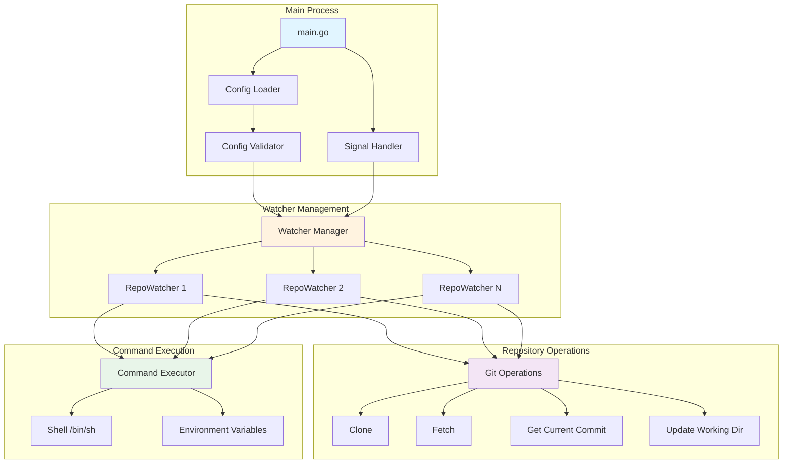
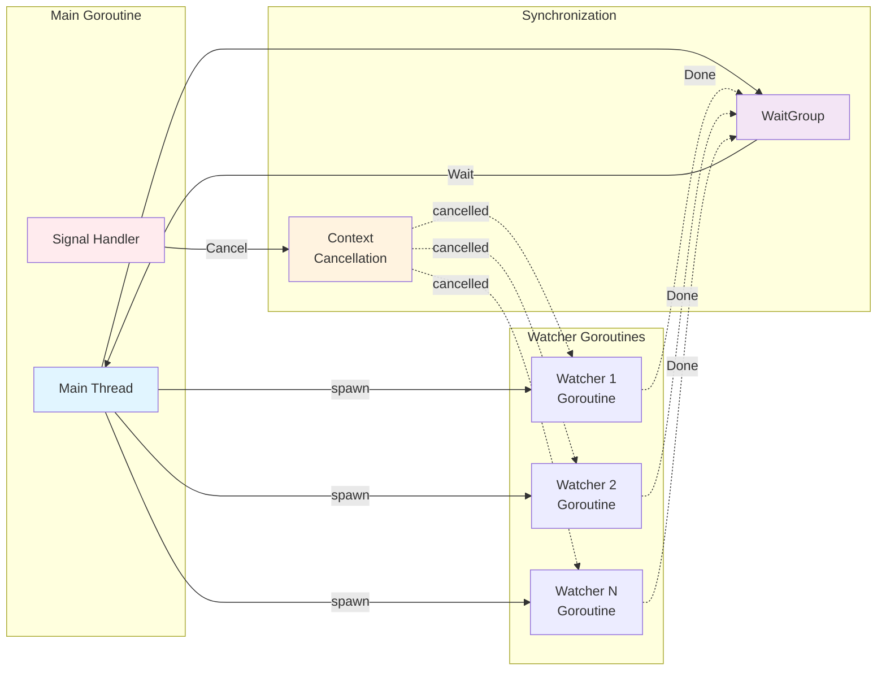
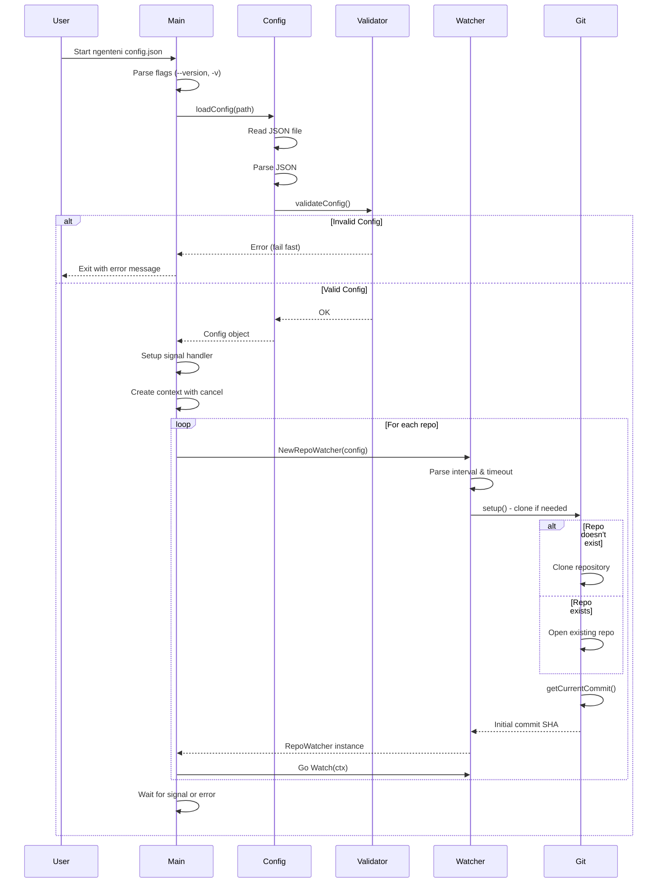
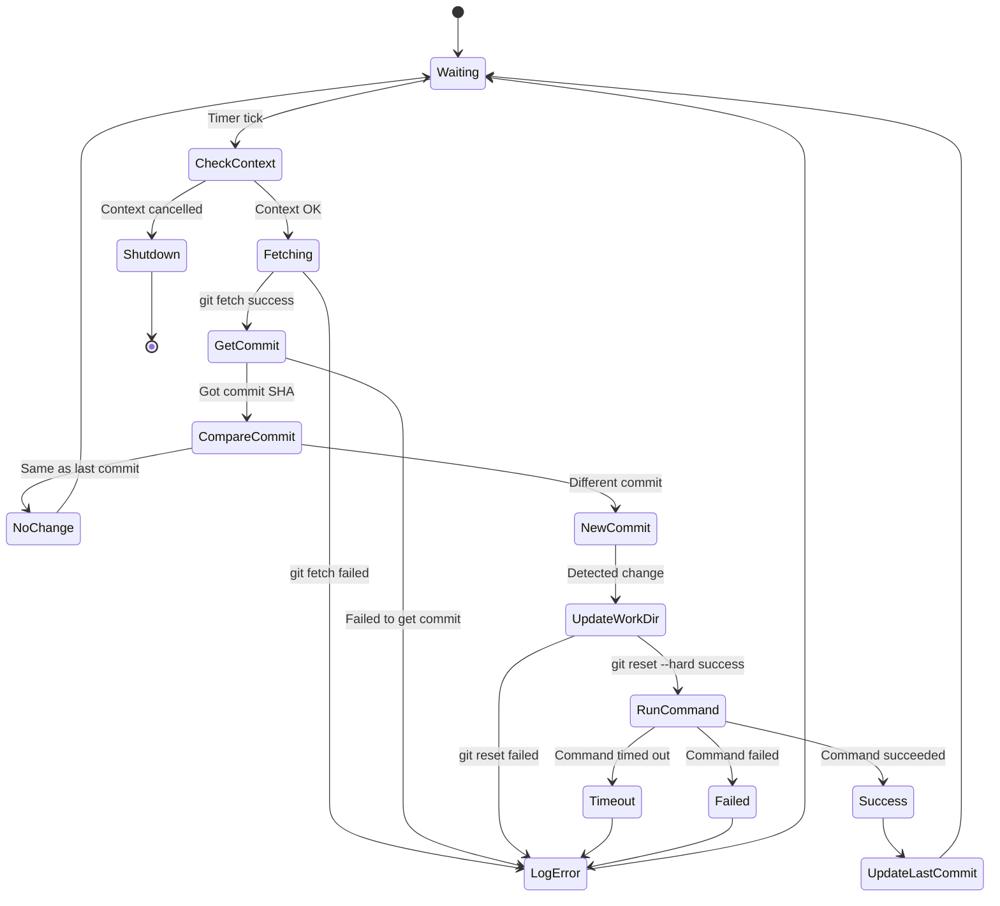
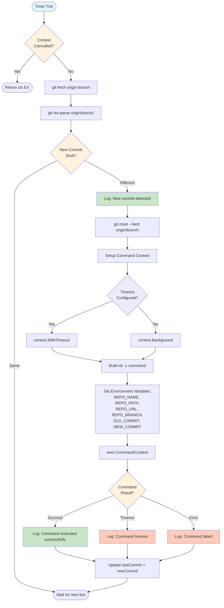
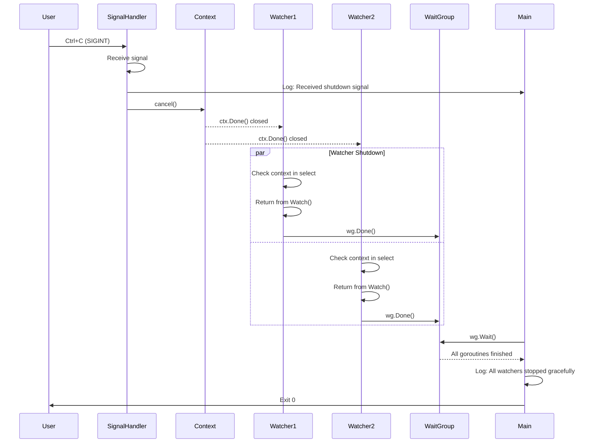
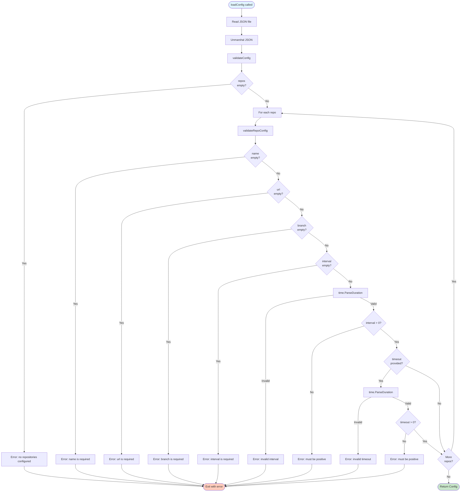

# Ngenteni Architecture

This document describes the internal architecture and workflow of ngenteni, a Git repository watcher that monitors remote repositories for new commits and executes commands when changes are detected.

## Table of Contents

- [Overview](#overview)
- [Core Components](#core-components)
- [System Architecture](#system-architecture)
- [Workflow Diagrams](#workflow-diagrams)
- [Data Structures](#data-structures)
- [Key Processes](#key-processes)
- [Error Handling](#error-handling)

## Overview

Ngenteni is a lightweight, single-binary tool written in Go that:
1. Monitors multiple Git repositories simultaneously
2. Detects new commits by polling remote branches
3. Synchronizes local working directories
4. Executes user-defined commands when changes occur
5. Supports graceful shutdown and timeout management

**Design Principles:**
- Simple: No dependencies, single binary
- Reliable: Fail-fast validation, graceful shutdown
- Observable: Clear logging, contextual error messages
- Configurable: JSON-based configuration

## Core Components



### Component Responsibilities

| Component | Responsibility |
|-----------|---------------|
| **Config Loader** | Reads and parses JSON configuration file |
| **Config Validator** | Validates all configuration fields at startup (fail-fast) |
| **Signal Handler** | Handles SIGINT/SIGTERM for graceful shutdown |
| **Watcher Manager** | Creates and manages multiple RepoWatcher goroutines |
| **RepoWatcher** | Monitors a single repository, detects changes, runs commands |
| **Git Operations** | Executes git commands (clone, fetch, rev-parse, reset) |
| **Command Executor** | Runs user commands with timeout and environment variables |

## System Architecture

### Concurrency Model



**Key Characteristics:**
- Each repository runs in its own goroutine
- Context-based cancellation for graceful shutdown
- WaitGroup ensures all watchers complete before exit
- No shared state between watchers (isolation)

## Workflow Diagrams

### 1. Initialization Flow



### 2. Watch Loop Flow



### 3. Change Detection and Execution



### 4. Graceful Shutdown Flow



## Data Structures

### Configuration Structure

```go
type Config struct {
    Repos []RepoConfig `json:"repos"`
}

type RepoConfig struct {
    Name     string `json:"name"`          // Required: Unique identifier
    URL      string `json:"url"`           // Required: Git repository URL
    Branch   string `json:"branch"`        // Required: Branch to monitor
    Interval string `json:"interval"`      // Required: Polling interval (e.g., "30s")
    Command  string `json:"command"`       // Required: Command to execute
    WorkDir  string `json:"workdir"`       // Required: Local clone directory
    Timeout  string `json:"timeout,omitempty"` // Optional: Command timeout
}
```

### Runtime Structure

```go
type RepoWatcher struct {
    config         RepoConfig      // Configuration for this repo
    repoPath       string          // Full path to local clone
    lastCommit     string          // Last known commit SHA
    interval       time.Duration   // Parsed polling interval
    commandTimeout time.Duration   // Parsed command timeout (0 = no timeout)
}
```

## Key Processes

### Config Validation Process



### Git Operations

**Clone Operation:**
```bash
git clone --branch <branch> <url> <path>
```

**Fetch Operation:**
```bash
git fetch origin <branch>
```

**Get Current Commit:**
```bash
git rev-parse origin/<branch>
```

**Update Working Directory:**
```bash
git reset --hard origin/<branch>
```

**Why `git reset --hard`?**
- Ensures working directory matches remote exactly
- Discards any local changes (expected behavior)
- Faster than pulling and merging
- Simpler for read-only monitoring use case

### Command Execution

**Environment Variables Passed to Commands:**

| Variable | Description | Example |
|----------|-------------|---------|
| `REPO_NAME` | Repository name from config | `my-project` |
| `REPO_PATH` | Local clone path | `/path/to/repos/my-project` |
| `REPO_URL` | Git repository URL | `https://github.com/user/repo.git` |
| `REPO_BRANCH` | Monitored branch | `main` |
| `OLD_COMMIT` | Previous commit SHA | `abc123def456...` |
| `NEW_COMMIT` | New commit SHA | `def456abc789...` |

## Error Handling

### Error Handling Strategy

| Error Type | Behavior | Recovery |
|------------|----------|----------|
| **Config Error** | Fail fast at startup | Fix config and restart |
| **Git Clone Error** | Log error, skip repo | Fix URL/access, restart |
| **Git Fetch Error** | Log error, retry next interval | Transient - auto-recovers |
| **Command Error** | Log error, continue watching | Check command, auto-retries on next commit |
| **Command Timeout** | Kill command, log error, continue | Adjust timeout or fix command |
| **Context Cancelled** | Stop gracefully, no error | Intentional shutdown |

### Logging Strategy

**Log Format:**
```
2026/01/12 10:30:45 [repo-name] Message
```
